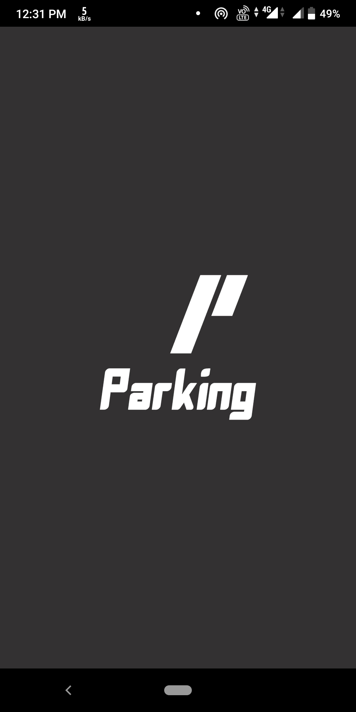
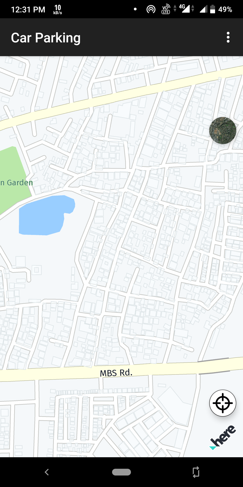
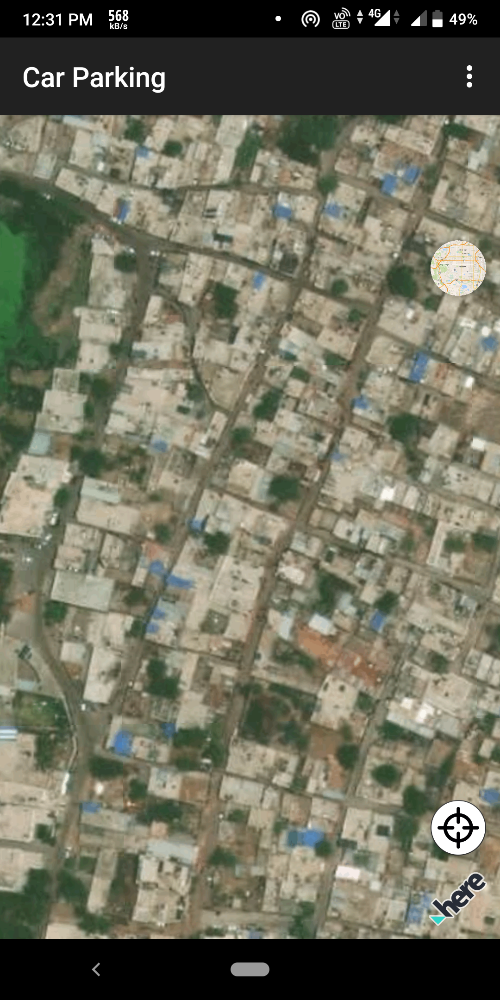
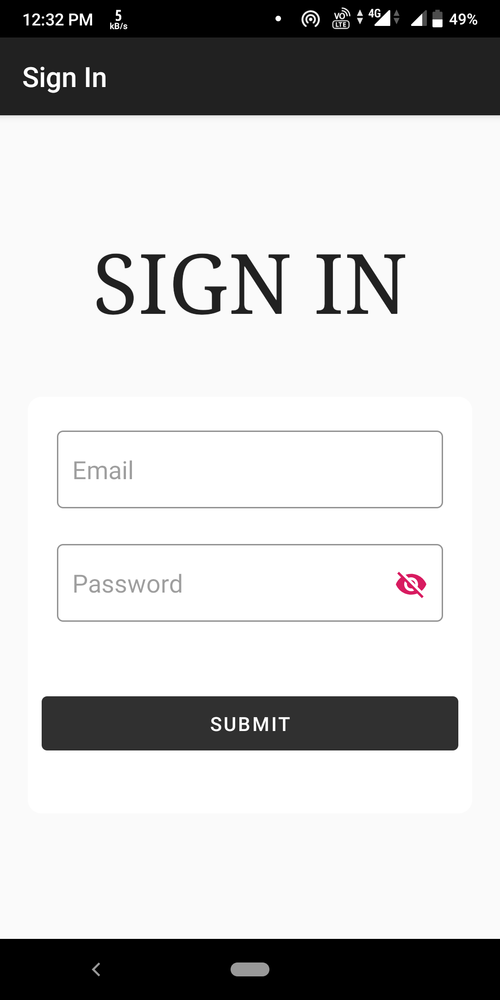
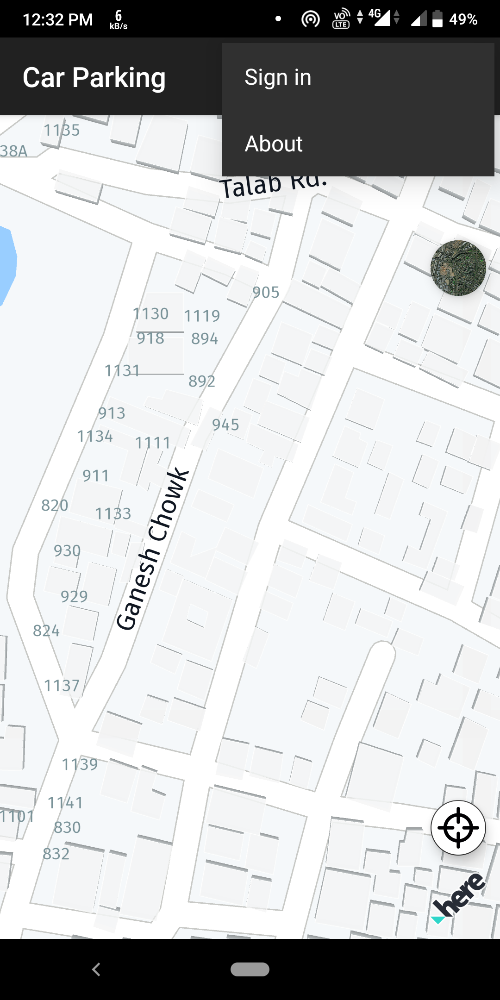
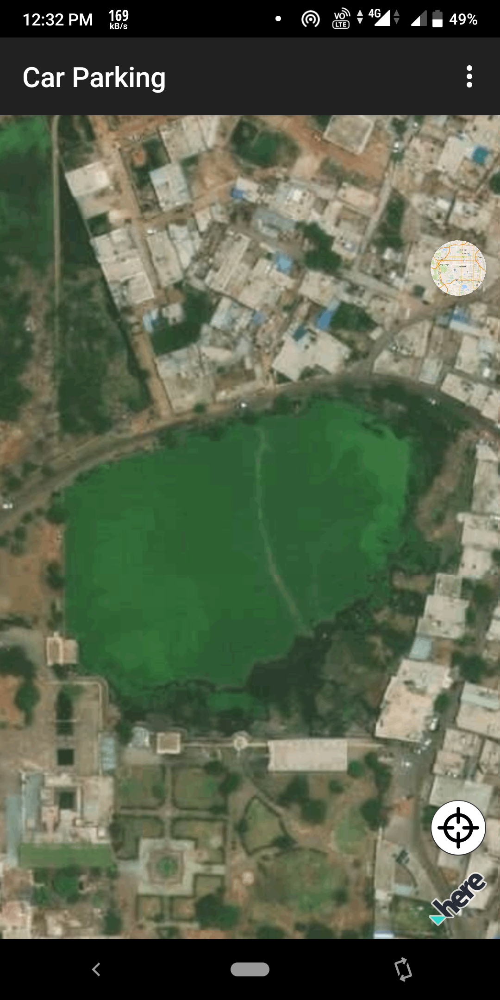
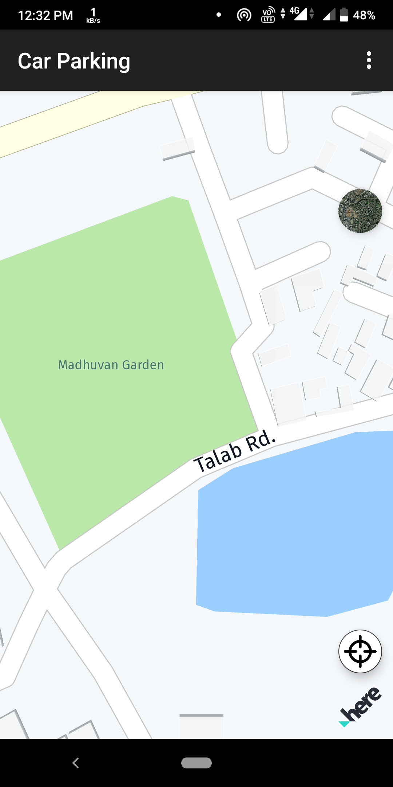

# CarParking

<h3><b>Problem Statement:</b></h3>

A major problem in metropolitan areas is finding parking spaces.
Existing parking guidance systems often adopt fixed sensors or cameras
that cannot provide information from the driver’s point of view. How
many times has it happened to you that you are searching for a parking
spot by driving around and around the parking lot? How convenient
would it be if your phone could tell you exactly where the closest parking
spot is!

<b>Technologies Used:</b>   
Computer Vision, Machine Learning, App Development, Cloud
Computing.

 <b>Approach to implement Project: </b>  
Obtaining Dataset with recording of parking lots having active
scenario of cars leaving and coming. With the help of the
dataset we have to train the model to detect cars, parking spots
and newly empty parking slots.
An app with a beautiful is UI is designed which has a map
marking all the location of parking slots with some standing out
mark. Tapping on the mark should show how many parking
slots are available in that parking lot. The user when selects the
parking lot, the app should guide the user to the parking lot.
The backend of the project is to be hosted on a cloud service
which will provide real time data to the data.

Timeline/Modular Segmentation of Project:  
Android developers will be designing the app and concurrently
mentees experiences with machine learning will achieve the results
they are supposed to achieve. After the backend is complete, the
cloud engineers will deploy the model on a cloud service. After which
the app developers will connect the cloud service with app to get the
real time data.

  
Screenshots :
   
   
   
   
   
   
   
   
